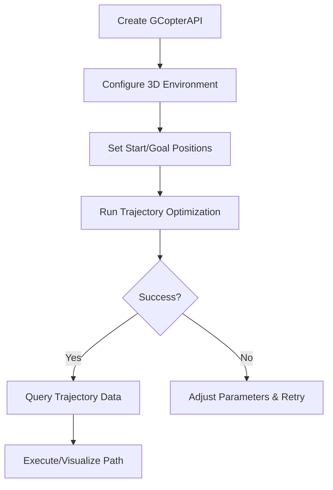

# drone-pathgen Documentation

Welcome to the comprehensive documentation for `drone-pathgen`, a Python wrapper around the GCOPTER trajectory optimizer for multicopter path planning.

## Table of Contents

1. **[Installation Guide](installation.md)** - System setup and installation instructions
2. **[User Guide](user_guide.md)** - Getting started and core concepts  
3. **[API Reference](api_reference.md)** - Complete API documentation
4. **[Examples](../examples/)** - Practical code examples and use cases

## Quick Start

```python
import numpy as np
import gcopter_cpp as gc

# Create API and configure environment
api = gc.GCopterAPI()
api.configure_map(
    map_size=np.array([20, 20, 10], dtype=np.int32),
    origin=np.array([-5.0, -5.0, 0.0]),
    voxel_scale=0.5,
    obstacle_points=[np.array([0.0, 0.0, 2.0])],
    dilation_radius=2
)

# Set trajectory endpoints
start = np.array([[-4.0], [-4.0], [1.0]])
goal = np.array([[4.0], [4.0], [3.0]])
api.set_endpoints(start, goal)

# Plan trajectory
success = api.run_inference(
    planning_timeout=5.0,
    time_weight=50.0,
    segment_length=2.0,
    smoothing_epsilon=1e-3,
    integral_resolution=8,
    magnitude_bounds=np.array([5., 10., np.pi/3, 5., 15.]),
    penalty_weights=np.array([1, 1, 1, 1, 1]),
    physical_params=np.array([1., 9.81, 0., 0., 0., 0.01])
)

# Get results
if success:
    stats = gc.TrajectoryStatistics()
    api.get_statistics(stats)
    print(f"✅ Planned {stats.total_duration:.2f}s trajectory")
```

## Library Overview

### Core Workflow



## Dependencies

- **Core**: NumPy, C++ libraries (OMPL, Eigen, Boost)
- **Visualization**: Open3D (optional)
- **Python**: 3.8 - 3.12 supported

## Getting Help

- Review [examples](../examples/) for implementation patterns
- Browse the [API reference](api_reference.md) for detailed documentation
- Submit issues on [GitHub](https://github.com/u-k-g/drone-pathgen/issues)

## Contributing

Contributions are welcome! Please:

1. Read the existing documentation
2. Check [GitHub Issues](https://github.com/u-k-g/drone-pathgen/issues) for open tasks
3. Follow the existing code style and patterns
4. Add tests for new functionality
5. Update documentation as needed

## License

Released under the MIT License - see [LICENSE](../LICENSE) for details.
